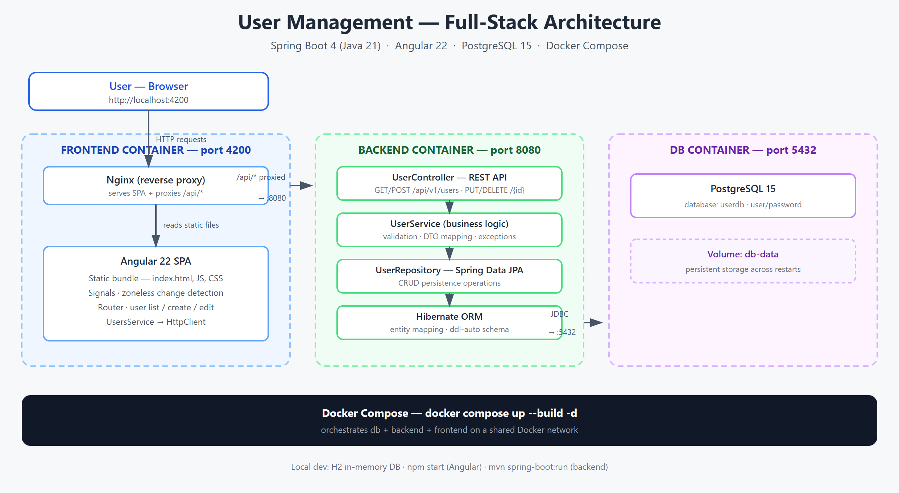
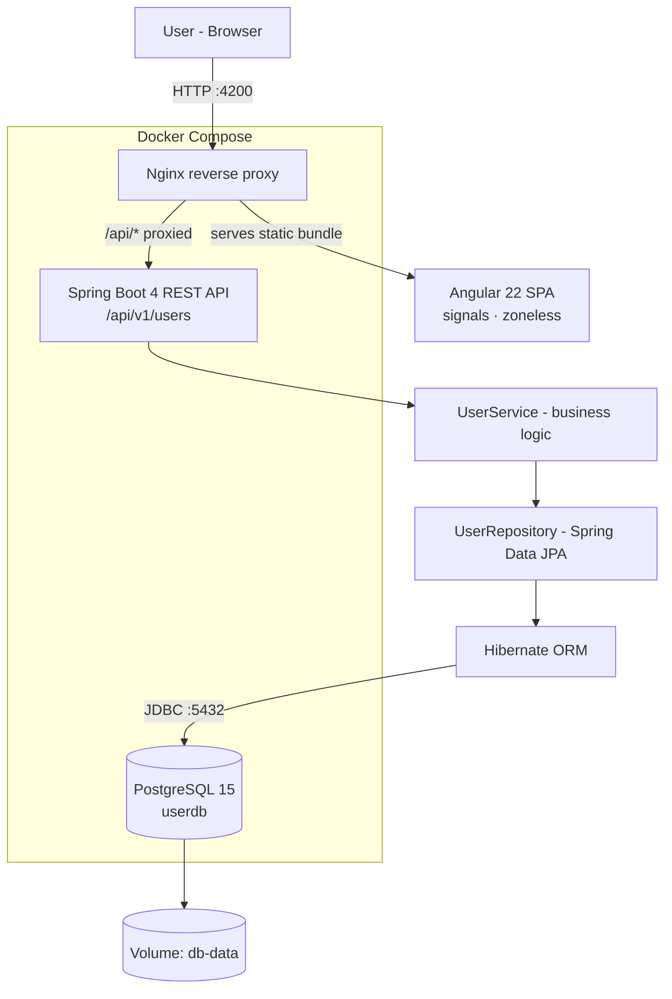

# springboot-angular

A User Management application built with a Spring Boot REST API, a PostgreSQL database, and an Angular 22 (zoneless) frontend. The root `docker-compose.yml` starts all three together.

## Tech stack

- **Frontend:** Angular 22 (standalone components, zoneless change detection with signals), nginx
- **Backend:** Spring Boot (Java 21), Spring Data JPA, Hibernate (schema managed by `ddl-auto`), bean validation
- **Database:** PostgreSQL 15 (H2 in-memory for local backend-only runs)
- **Packaging:** Multi-stage Docker builds for backend and frontend, orchestrated with Docker Compose

## Architecture





## Project structure

```text
backend/            Spring Boot application (pom.xml, src/main/java, db/migration)
frontend/           Angular application (src/app, nginx.conf, Dockerfile)
docker-compose.yml  PostgreSQL + backend + frontend stack
```

## Local development (Windows)

### 1. Run all services with Docker Compose

Open PowerShell in the repository root and run:

```powershell
cd D:\Projects\self\springboot-angular
docker compose up --build
```

If your Docker installation uses the legacy CLI, use:

```powershell
docker-compose up --build
```

The services are exposed as:

- Frontend: `http://localhost:4200`
- Backend API: `http://localhost:8080/api/v1/users`
- Postgres: `localhost:5432` (`user` / `password`, database `userdb`)

### 2. Backend only (Windows)

Open PowerShell in `backend/backend` and run:

```powershell
cd D:\Projects\self\springboot-angular\backend\backend
.\mvnw.cmd spring-boot:run
```

If the backend needs a database, make sure Postgres is available and the environment variables are set or a local profile is active.

### 3. Frontend only (Windows)

Open PowerShell in `frontend` and run:

```powershell
cd D:\Projects\self\springboot-angular\frontend
npm install
npm start
```

Then browse to `http://localhost:4200`.

### 4. Frontend proxy configuration

The frontend Docker image uses `nginx` and a custom proxy configuration so requests to `/api` are forwarded to the backend service at `http://backend:8080`. That allows the browser to call API URLs like `http://localhost:4200/api/v1/users` without CORS issues when running via Docker Compose.

When running the Angular dev server directly, the app calls the backend through CORS (`http://localhost:8080`), which the backend allows via `@CrossOrigin`.

> **Note:** `frontend/src/app/features/users/services/users.service.ts` points to `http://localhost:8080/api/v1/users` whenever the app is served on port `4200`, and to the relative `/api/v1/users` path otherwise. On a remote deployment where the frontend is served from a different port, prefer the relative `/api` path and route it to the backend.

## Deployment

### Docker Compose (single server / VPS)

The provided `docker-compose.yml` is the fastest way to deploy on any Docker host:

```powershell
docker compose up -d --build
```

Backend configuration is controlled by environment variables (see `docker-compose.yml`):

| Variable | Default |
| --- | --- |
| `SPRING_DATASOURCE_URL` | `jdbc:postgresql://db:5432/userdb` |
| `SPRING_DATASOURCE_USERNAME` | `user` |
| `SPRING_DATASOURCE_PASSWORD` | `password` |
| `SPRING_JPA_HIBERNATE_DDL_AUTO` | `update` |

Useful commands:

```powershell
docker compose ps
docker compose logs backend
docker compose logs frontend
docker compose logs db
docker compose down
```

### Cloud platforms

Because every piece is containerized, the stack can be lifted to:

- **Cloud Run / Azure Container Apps / AWS ECS / Render / Railway** — push the three services and point the frontend's `/api` proxy at the backend service URL (update `nginx.conf`), and configure the backend environment variables above.
- **Static frontend hosting (Netlify / Vercel / S3+CloudFront)** — `npm run build`, deploy `frontend/dist/frontend`, and run the Spring Boot jar separately (e.g. on a VM, Heroku, or Render) with the host routing `/api` to the backend.
